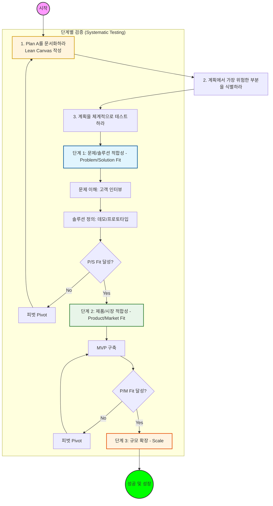

# 린 스타트업 (Lean Startup) 흐름도 - Ash Maurya 'Running Lean' 기준

애시 모리아(Ash Maurya)의 'Running Lean(린 스타트업)' 방식에 따른 사업 흐름도입니다.

## 상세 설명

### 1. Plan A를 문서화하라 (Lean Canvas)
- 한 페이지 분량의 **린 캔버스(Lean Canvas)**를 사용하여 가설을 빠르게 정리합니다.
- 복잡한 사업 계획서 대신, 핵심 요소(문제, 솔루션, 고유 가치 제안 등)에 집중합니다.

### 2. 가장 위험한 부분 식별
- 모든 가설이 같은 무게를 갖지 않습니다.
- 제품을 만들기 전에 **사용자가 실제로 이 문제를 겪고 있는지**, **돈을 지불할 의사가 있는지** 등을 먼저 검증해야 합니다.

### 3. 체계적인 테스트 (Iterative Process)
- **문제/솔루션 적합성 (Problem/Solution Fit):** "해결할 가치가 있는 문제인가?"를 확인합니다.
- **제품/시장 적합성 (Product/Market Fit):** "사람들이 원하는 제품을 만들었는가?"를 확인합니다.
- **규모 확장 (Scale):** 성장을 가속화합니다.

---
작성일: 2026-01-27
작성자: Antigravity AI Assistant
