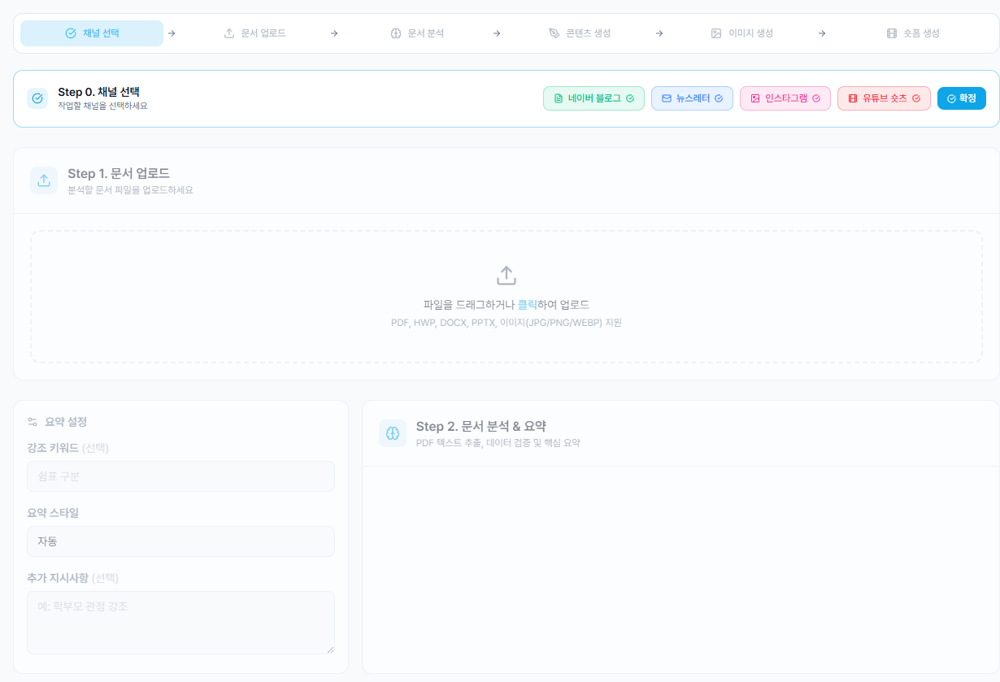
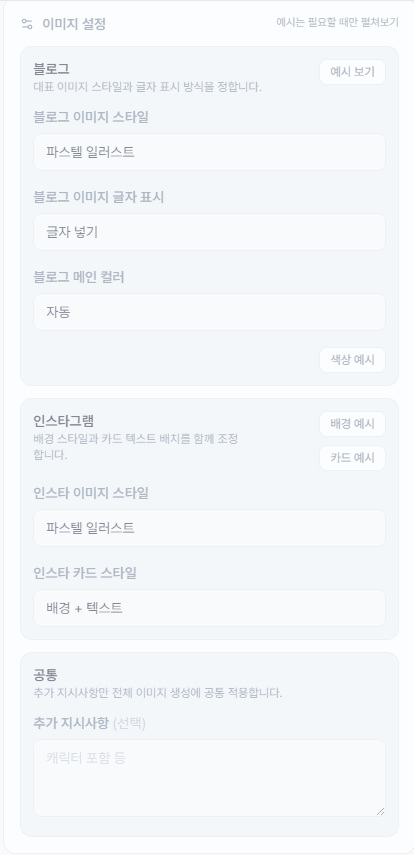
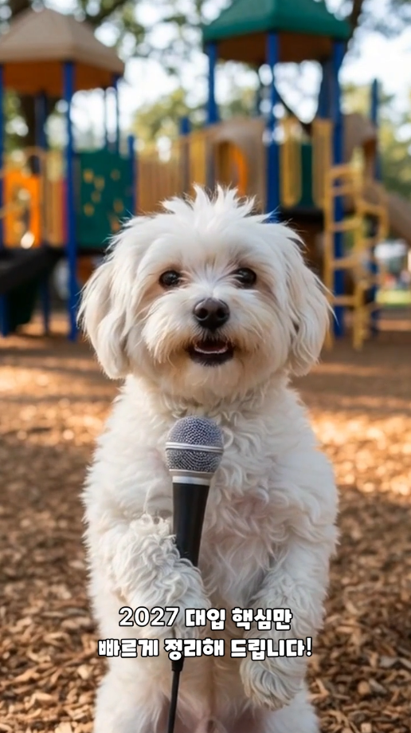
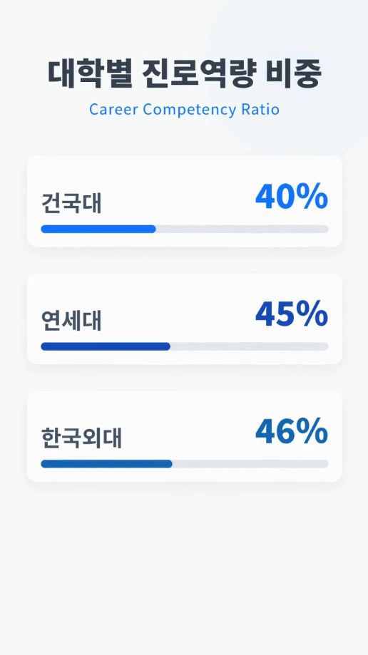
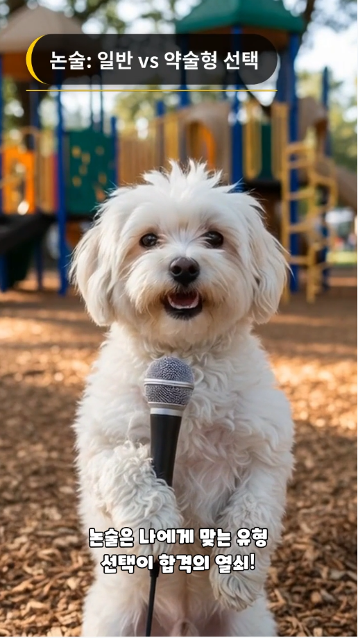

# AutoForm Creator
### 멀티채널 콘텐츠 자동 생성·배포 SaaS 포트폴리오

> 한 개의 자료(PDF)에서 출발해 **블로그 · 뉴스레터 · 인스타그램 · 유튜브 숏츠** 4개 채널의 콘텐츠를 동시에 자동 생성하고, 각 플랫폼에 자동 업로드·예약 발행까지 마쳐주는 **콘텐츠 자동화 SaaS** 입니다.

---

## 1. 어떤 서비스인가요?

사람이 직접 만들면 **반나절 이상 걸리는 멀티채널 콘텐츠 작업**을, 자료 한 번 업로드만으로 **수 분 안에 끝낼 수 있도록** 만든 자동화 서비스입니다.

- **입력** : 원본 PDF 1개 (보고서, 리서치, 트렌드 자료 등)
- **출력** : 4개 채널용 콘텐츠 + 카드 이미지 + 숏폼 영상까지 한 번에
- **운영** : 사용자 한 명이 마케팅·콘텐츠 운영을 혼자 돌릴 수 있는 수준의 자동화

---

## 2. 어떻게 동작하나요?

사용자 입장에서의 동작 흐름은 단 4단계입니다.

> **① 자료 업로드 → ② AI 분석 · 데이터 추출 → ③ 채널별 콘텐츠 자동 생성 → ④ 자동 업로드 또는 예약 발행**

각 단계에서 시스템이 하는 일을 풀어보면 다음과 같습니다.

| 단계 | 시스템이 하는 일 |
|---|---|
| ① 자료 업로드 | 사용자는 원본 PDF만 업로드하면 이후 단계는 모두 자동 진행 |
| ② AI 분석 | 문서를 읽고 핵심 데이터·인사이트·키워드를 자동 정리, **답변의 신뢰도까지 자체 검증** |
| ③ 채널별 콘텐츠 생성 | 같은 내용을 채널 톤매너에 맞게 **4가지 형태로 동시 변형**. 카드 이미지·숏폼 영상까지 자동 합성 |
| ④ 업로드 / 예약 | 네이버 블로그, 유튜브, 인스타그램 등에 **클릭 한 번으로 업로드** 또는 예약 발행 |

---

## 3. 채널별로 무엇이 만들어지나요?

| 채널 | 자동으로 만들어지는 결과물 |
|---|---|
| 네이버 블로그 | 제목 / 섹션별 본문 / 태그 / 본문 포맷까지 정돈 |
| 뉴스레터 | 헤드라인 / 프리헤더 / 핵심 포인트 / 본문 / 데이터 하이라이트 |
| 인스타그램 | 캡션 / 해시태그 / **6장 캐러셀 카드 이미지 자동 합성** |
| 유튜브 숏츠 | 9:16 영상 (훅 → 씬별 자막·나레이션) / 업로드용 제목·설명·해시태그 |

> 각 채널은 단순 텍스트 뽑기가 아니라, **그 플랫폼에서 실제로 잘 먹히는 형태**로 톤·길이·구조를 다르게 가공합니다.
> 아래는 그 가공 규칙의 일부입니다.

| 채널 | 플랫폼 최적화를 위해 적용한 규칙 |
|---|---|
| 네이버 블로그 | **본문 16pt · 소제목 24pt 자동 적용** (네이버 모바일 가독성 최적값) · 섹션 헤딩 단락 분리 · 키워드 자동 태그 정제 · 네이버 에디터 서식과 충돌하지 않는 본문 sanitizer 적용 |
| 뉴스레터 | Subject + Preheader 패턴 (메일함 노출률 최적화) · 데이터 하이라이트는 **"수치 + 라벨" 카드형 블록**으로 본문과 분리 · 핵심 포인트는 3개 이내로 압축 |
| 인스타그램 | 본문을 **6장 캐러셀로 자동 분할** (인스타 알고리즘이 가장 잘 노출하는 카드 수) · 카드별 **"헤드라인 + 데이터 포인트"** 구조 강제 · 해시태그와 캡션 분리 작성 |
| 유튜브 숏츠 | **훅을 별도 필드로 강제 분리해 영상 첫 씬에 자동 배치** (이탈 방지) · 씬은 **약 6초 단위 디폴트 + 총 20 ~ 30초** 자동 분할 · 9:16 세로 포맷 강제 · 자막 burn-in 스타일 자동 매핑 |

---

## 4. 어떻게 좋은 퀄리티를 만드나요?

이 부분이 단순 자동화 툴과 가장 크게 다른 지점입니다.

### ① "한 번에 다 만든다"가 아니라 "단계별로 검증한다"
AI가 만든 결과를 그대로 내보내지 않습니다. **채널 선택 → 문서 업로드 → 문서 분석 → 콘텐츠 생성 → 이미지 생성 → 숏폼 생성**까지 단계를 분리해 두고, 각 단계에서 **AI 스스로 답변의 신뢰도를 평가**하며 검증을 통과한 데이터만 다음 단계로 넘어갑니다. 잘못된 숫자·왜곡된 인사이트가 그대로 나가는 일을 줄였습니다.

*▲ 단계별로 진행 상태가 표시되는 실제 운영 화면 (채널 선택부터 숏폼 생성까지 6단계)*

### ② 사용자가 원하는 방향을 직접 입력할 수 있는 구조
AI에게 모든 것을 맡기는 게 아니라, 사용자가 결과를 자신의 톤으로 끌어올 수 있도록 **강조 키워드 · 요약 스타일 · 추가 지시사항 · 이미지 스타일 · 메인 컬러 · 카드 스타일** 등을 각 단계에서 직접 입력할 수 있는 프롬프트 인풋을 제공합니다. AI 자동화의 편의성과 사용자가 원하는 방향성을 모두 잡았습니다.

*▲ 블로그·인스타그램 이미지 스타일과 추가 지시사항을 사용자가 직접 입력할 수 있는 패널*

### ③ 채널별 톤매너 분리
같은 원본이라도 **블로그는 길고 차분하게**, **인스타는 짧고 시각적으로**, **숏츠는 훅 중심**으로 따로 학습된 프롬프트 체계를 갖췄습니다. 결과물이 "전부 비슷한 느낌"이 되지 않습니다.

### ④ 영상은 "편집한 것처럼" 자동 렌더링
숏폼 영상은 단순 슬라이드쇼가 아닙니다. 9:16 세로 포맷으로 **타이틀 씬 / 인포그래픽 씬 / 자막 씬을 분리**해 렌더링하기 때문에, 실제 편집자가 만든 듯한 결과가 나옵니다. 자막·나레이션·인포그래픽이 자동으로 동기화됩니다.

| 캐릭터 인트로 + 자막 burn-in | 데이터 인포그래픽 씬 | 설명 자막 씬 |
|:---:|:---:|:---:|
|  |  |  |

*▲ 한 영상 안에서도 씬마다 다른 컴포지션을 자동으로 합성합니다 (실제 산출물 캡처)*

### ⑤ 한국 시장에 특화된 업로드 자동화
유튜브·인스타그램 같은 글로벌 채널은 공식 API로 깔끔하게 처리하고, **공식 API가 없는 네이버 블로그는 자체 RPA(자동화 로봇)으로 해결**했습니다. 로그인 세션을 안전하게 보관해 다음부터는 무인으로 업로드되도록 설계했습니다.

### ⑥ 사용자 PC에서 도는 "데스크톱 헬퍼"라는 하이브리드 구조
서버에서만 도는 다른 SaaS와 달리, 본 서비스는 **웹 + 사용자 PC에 자동 설치되는 헬퍼 프로그램**의 하이브리드 구조입니다. 덕분에 네이버처럼 서버 IP를 차단하는 플랫폼에도 안정적으로 업로드할 수 있고, 사용자 본인의 계정으로 자연스럽게 동작합니다.

### ⑦ 운영을 못 하는 시간에도 알아서 발행
예약 업로드는 단순히 시스템 안에만 머무는 게 아니라, **각 플랫폼의 공식 예약 발행 기능에 직접 등록**해줍니다. 예약 후엔 사용자 PC를 꺼도 정해진 시간에 발행됩니다.

---

## 5. 의뢰 주신 "숏폼 자동화 시스템"과의 연결

요청해주신 4개 영역 중 **2 · 3 · 4번 영역이 본 서비스에서 이미 검증된 구조**와 거의 동일합니다.

| 의뢰하신 기능 | 본 프로젝트에서의 상태 |
|---|---|
| **AI 콘텐츠 제작** | |
| 자막 자동 생성 / 나레이션(TTS) | ✅ 이미 운영 중 |
| 훅 장면 자동 생성 | ✅ 이미 운영 중 |
| 9:16 / Shorts·Reels 비율 자동 최적화 | ✅ 이미 운영 중 (영상 자동 렌더링 엔진 보유) |
| 자동 컷 편집 | ✅ 씬 단위 자동 컷 구조 보유 |
| **콘텐츠 최적화** | |
| 제목·해시태그 자동 생성 | ✅ 이미 운영 중 |
| 채널별 톤매너 자동 분리 | ✅ 이미 운영 중 |
| **업로드·운영 자동화** | |
| 다채널 업로드 관리 (YouTube · IG · 네이버) | ✅ 이미 운영 중 |
| 예약 업로드 | ✅ 이미 운영 중 |
| 성과 데이터 수집 구조 | ✅ 기본 구조 보유 |
| **신규 개발이 필요한 영역** | |
| 영상 소스 수집 (키워드 기반 영상 크롤링) | 🆕 신규 개발 필요 |
| 원본 영상 분석 기반 자동 컷 | 🆕 신규 개발 필요 (현재는 무→유 생성, 새 시스템은 기존 영상 가공) |
| TikTok 업로드 | 🆕 신규 채널 추가 필요 |
| 바이럴 패턴 분석 엔진 | 🆕 신규 개발 필요 |

> 즉, **콘텐츠 생성 / 영상 자동 렌더링 / 멀티채널 업로드 / 예약 발행** 부분은 본 프로젝트 자산을 그대로 활용해 빠르게 입혀드릴 수 있고, 새 프로젝트의 핵심 차별점인 **"기존 영상 수집 → 분석 → 가공"** 영역에 개발 리소스를 집중할 수 있습니다.

---

## 6. 본 프로젝트로 검증된 것

이 프로젝트를 통해 다음을 **운영 환경에서 직접 검증**했습니다.

- ✅ 한국어 환경에서의 AI 멀티채널 콘텐츠 생성 품질
- ✅ 9:16 세로 숏폼 영상의 자동 합성·렌더링
- ✅ 네이버 같은 한국 플랫폼의 안정적 자동 업로드 (RPA)
- ✅ 글로벌 플랫폼(YouTube, Instagram) 공식 OAuth 연동
- ✅ 사용자 PC에 헬퍼를 설치해 웹과 연동시키는 하이브리드 SaaS 모델
- ✅ 채널별 예약 발행 / 세션 만료 자동 감지·복구

---

## 7. 사용 기술 (요약)

- **AI 엔진** : LlamaParse (문서 분석) · Google Gemini (콘텐츠 생성) · Flux (이미지 생성)
- **영상 자동 렌더링** : Remotion 기반 자체 컴포지션 (타이틀·자막·인포그래픽 분리)
- **웹 / 서버** : React 19, Vite, Tailwind / Node.js · Express
- **자동 업로드** : Google · Meta 공식 OAuth API + 자체 RPA(Electron + Playwright)
- **인프라** : Vercel Serverless
