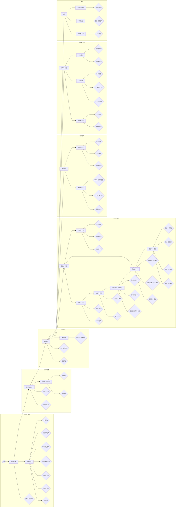

```mermaid
flowchart LR

  subgraph s7 ["구독자 랜딩"]
    n1(("시작"))
    n57["랜딩페이지"]
    n58{"콘텐츠 미리보기"}
    n59["구독 신청"]
    n60{"이름 입력"}
    n61{"연락처 입력"}
    n62{"이메일 입력"}
    n63{"카카오톡 ID 입력"}
    n64{"알림 수신 동의"}
    n65{"개인정보 동의"}
    n66{"구독 완료"}
  end

  subgraph s1 ["관리자 인증"]
    n2["관리자 로그인"]
    n3{"이메일 로그인"}
    n4{"소셜 로그인"}
    n5["관리자 회원가입"]
    n6{"정보 입력"}
    n8{"약관 동의"}
  end

  subgraph s2 ["대시보드"]
    n9["대시보드"]
    n10{"통계 확인"}
    n11{"최근 활동 조회"}
    n12["배포 현황"]
    n13{"플랫폼별 상태 확인"}
  end

  subgraph s3 ["콘텐츠 관리"]
    n14["콘텐츠 관리"]
    n15["PDF 업로드"]
    n16{"파일 선택"}
    n17{"업로드 실행"}
    n18["AI 분석 결과"]
    n19{"요약 확인"}
    n20{"AI 이미지 생성"}
    n21["콘텐츠 생성"]
    n22{"블로그 글 생성"}
    n23{"인스타그램 콘텐츠 생성"}
    n25{"뉴스레터 초안 생성"}
    n26["콘텐츠 편집"]
    n27{"텍스트 수정"}
    n28{"이미지 수정"}
    n29{"저장/삭제"}
    n67["하이라이트 추출 결과"]
    n68{"하이라이트 목록 확인"}
    n69{"하이라이트 선택"}
    n70{"하이라이트 수정"}
    n71["영상 자동 생성"]
    n72{"숏폼 영상 생성"}
    n73{"롱폼 영상 생성"}
    n74{"영상 미리보기"}
    n75{"영상 수정 요청"}
  end

  subgraph s4 ["배포 관리"]
    n30["배포 관리"]
    n31["플랫폼 연동"]
    n32{"유튜브 연동"}
    n33{"인스타그램 연동"}
    n34{"네이버 블로그 연동"}
    n35["콘텐츠 배포"]
    n36{"플랫폼 선택"}
    n37{"즉시 발행"}
    n38{"예약 발행"}
  end

  subgraph s5 ["구독자 관리"]
    n39["구독자 관리"]
    n40["구독자 목록"]
    n41{"구독자 검색"}
    n42{"그룹 지정"}
    n43["알림 발송"]
    n44{"뉴스레터 발송"}
    n45{"카카오톡 알림톡"}
    n46{"SMS 발송"}
    n47["발송 통계"]
    n48{"오픈율 확인"}
    n49{"클릭률 확인"}
  end

  subgraph s6 ["설정"]
    n50["설정"]
    n51["프로필 설정"]
    n52{"정보 수정"}
    n53["알림 설정"]
    n54{"알림 채널 관리"}
    n55["개인정보 보호"]
    n56{"데이터 관리"}
  end

  n2 --> n3
  n2 --> n4
  n2 --> n5
  n5 --> n6
  n5 --> n8
  n2 --> n9
  n9 --> n10
  n9 --> n11
  n9 --> n12
  n12 --> n13
  n9 --> n14
  n14 --> n15
  n15 --> n16
  n15 --> n17
  n15 --> n18
  n18 --> n19
  n18 --> n20
  n14 --> n21
  n21 --> n22
  n21 --> n23
  n21 --> n25
  n14 --> n26
  n26 --> n27
  n26 --> n28
  n26 --> n29
  n9 --> n30
  n30 --> n31
  n31 --> n32
  n31 --> n33
  n31 --> n34
  n30 --> n35
  n35 --> n36
  n35 --> n37
  n35 --> n38
  n9 --> n39
  n39 --> n40
  n40 --> n41
  n40 --> n42
  n39 --> n43
  n43 --> n44
  n43 --> n45
  n43 --> n46
  n39 --> n47
  n47 --> n48
  n47 --> n49
  n9 --> n50
  n50 --> n51
  n51 --> n52
  n50 --> n53
  n53 --> n54
  n50 --> n55
  n55 --> n56
  n57 --> n58
  n57 --> n59
  n59 --> n60
  n59 --> n61
  n59 --> n62
  n59 --> n63
  n59 --> n64
  n59 --> n65
  n59 --> n66
  n57 --> n2
  n1 --> n57
  n18 --> n67
  n67 --> n68
  n67 --> n69
  n67 --> n70
  n21 --> n71
  n71 --> n72
  n71 --> n73
  n71 --> n74
  n71 --> n75
  n67 --> n21
```
